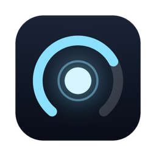

<p align="center">
  
</p>

<h1 align="center">AI reactor</h1>

<p align="center">
  macOS 메뉴 막대의 작은 게이지 두 개로 <b>Claude</b>와 <b>Codex</b>의 남은 사용 한도를 확인하세요.
</p>

<p align="center">
  
</p>

- **에이전트별 게이지.** 원호는 **현재 세션**의 남은 한도를 나타내고, 가운데 로고는 어떤 에이전트인지 보여줍니다.
- **클릭해서 상세 정보 확인.** 팝오버에서 모든 한도 구간(5시간, 주간, 월간), 각 한도의 초기화 시각, 계정과 요금제를 확인할 수 있습니다.
- **방해 없이 동작.** Dock 아이콘 없이 메뉴 막대에서만 실행됩니다. 백그라운드에서는 3분마다, 팝오버가 열려 있을 때는 30초마다 확인합니다.
- **별도 서버 없음.** 자체 서버나 원격 측정 없이 Claude Code와 Codex CLI의 공식 로그인 경로로 각 서비스의 사용량만 조회합니다.

> AI reactor는 비공식·비상업 프로젝트입니다. Anthropic 또는 OpenAI와 제휴 관계가 없으며 이들로부터 보증이나 승인을 받지 않았습니다. "Claude", "ChatGPT/Codex" 및 관련 로고의 권리는 각 소유자에게 있으며, 여기서는 게이지가 어떤 서비스를 나타내는지 표시하기 위한 용도로만 사용합니다.

## 요구 사항

- macOS 13 이상(Apple Silicon 및 Intel 지원)
- **Claude:** [Claude Code](https://docs.anthropic.com/en/docs/claude-code)가 설치되어 있고 Claude 구독 계정으로 로그인되어 있어야 합니다(`claude` → `/login`).
- **Codex:** [Codex CLI](https://github.com/openai/codex)가 설치되어 있고 ChatGPT 계정으로 로그인되어 있어야 합니다. 실시간 조회를 지원하지 않는 이전 버전에서는 로컬 세션 로그를 대신 읽습니다.

Claude나 Codex 중 하나만 사용해도 됩니다. 사용하지 않는 서비스의 게이지는 표시되지 않습니다.

## 설치

1. [**Releases**](https://github.com/jen454/AI-reactor/releases/latest)에서 `AI.reactor_x.y.z_universal.dmg`를 다운로드합니다.
2. 파일을 열고 **AI reactor**를 **응용 프로그램** 폴더로 드래그합니다.
3. 응용 프로그램에서 **AI reactor**를 실행합니다. 앱이 유료 Apple Developer ID로 서명되지 않았기 때문에 macOS가 처음 실행을 차단합니다.
   - **시스템 설정 → 개인정보 보호 및 보안**으로 이동한 다음, 아래로 스크롤하여 AI reactor 관련 메시지 옆의 **그래도 열기**를 누릅니다. 최근 macOS에서는 우클릭 후 **열기** 방식이 더 이상 동작하지 않습니다.
   - 또는 터미널에서 다음 명령을 실행합니다.
     ```sh
     xattr -dr com.apple.quarantine "/Applications/AI reactor.app"
     ```

### 다운로드 파일 확인

**AI reactor는 반드시 이 저장소의 [Releases](https://github.com/jen454/AI-reactor/releases) 페이지에서만 다운로드하세요.** 이 앱에는 Claude 로그인 정보에 접근할 권한을 부여하게 됩니다. 또한 Apple Developer ID로 서명되지 않았기 때문에 macOS만으로는 누가 앱을 만들었는지 확인할 수 없습니다. 따라서 직접 검증하는 것이 좋습니다.

```sh
# 공개 저장소인 경우, 이 저장소의 소스 코드로 GitHub Actions에서 빌드됐는지 확인
gh attestation verify "AI.reactor_0.2.3_universal.dmg" -R jen454/AI-reactor

# 또는 같은 릴리스의 SHA256SUMS.txt와 해시 비교
shasum -a 256 "AI.reactor_0.2.3_universal.dmg"
```

## 최초 실행

메뉴 막대에 게이지가 나타나며 macOS에서 다음과 같은 메시지를 표시합니다.

> **“AI reactor”가 키체인의 “Claude Code-credentials”에 저장된 기밀 정보를 사용하려고 합니다.**

**항상 허용**을 선택하면 이후부터 자동으로 사용량을 추적합니다.

- **항상 허용**이 아닌 일반 **허용**을 누르면 앱이 재시작될 때까지만 유효하므로 다음 실행 때 다시 묻습니다.
- **거부**를 누르면 Claude 카드에 해당 상태가 표시되고 잠시 후 다시 권한을 요청합니다.
- **앱을 업데이트할 때마다** macOS가 다시 한 번 권한을 묻습니다. 서명되지 않은 앱은 정확한 빌드를 기준으로 기억하므로 새 버전은 매번 새로운 앱으로 인식합니다. 이때 다시 **항상 허용**을 누르면 됩니다.
- Codex에는 별도의 접근 권한이 필요하지 않습니다.

선택 사항으로 메뉴 막대 아이콘을 우클릭하고 **로그인 시 자동 실행**을 선택하면 Mac을 재시작한 후에도 자동으로 추적을 계속합니다.

## 앱이 읽는 정보

| 읽는 정보 | 위치 | 사용 목적 |
|---|---|---|
| Claude Code 로그인 토큰 | 키체인의 `Claude Code-credentials` 항목. 키체인 항목이 없으면 `~/.claude/.credentials.json`을 읽기 전용으로 사용 | Claude CLI의 `/usage`와 동일한 방식으로 Anthropic에 사용량 조회 요청 |
| Claude 계정 이메일과 요금제 | `~/.claude.json`의 `oauthAccount`를 읽기 전용으로 사용 | 팝오버에 계정 정보 표시 |
| Codex 한도 | 설치된 `codex app-server`의 `account/rateLimits/read` | Codex가 인증과 토큰 갱신을 맡은 상태에서 현재 한도를 조회 |
| Codex 한도와 요금제(대체 경로) | `~/.codex/sessions/**/rollout-*.jsonl`을 읽기 전용으로 사용 | App Server 조회가 불가능할 때 마지막 로그 기록을 표시 |

앱이 절대로 하지 않는 일:

- **토큰을 갱신하거나 수정하지 않습니다.** 토큰은 `claude` CLI의 소유입니다. Claude Code가 토큰을 교체해 기존 토큰이 거부되면 키체인의 최신 값을 다시 읽어 한 번 재시도합니다. 최신 값도 만료된 경우에는 카드에서 `claude`를 한 번 실행하라고 안내합니다.
- `~/.claude` 또는 `~/.codex`에 **파일을 쓰지 않습니다.**
- `~/.codex/auth.json`을 **읽지 않습니다.** 이 때문에 Codex 카드에는 요금제는 표시되지만 이메일은 표시되지 않습니다.
- 토큰은 메모리에만 보관하며 파일이나 로그에 저장하지 않습니다.

AI reactor가 직접 보내는 네트워크 요청은 `GET https://api.anthropic.com/api/oauth/usage`뿐입니다. Codex 한도 조회는 별도로 설치된 Codex CLI의 App Server가 기존 로그인을 사용해 수행합니다.

## 알아둘 점

- **사용에 따른 책임은 사용자에게 있습니다.** AI reactor는 Claude Code가 Mac에 저장한 로그인을 재사용하여 사용량을 조회합니다. Claude Code의 `/usage`와 동일한 읽기 전용 요청이지만, 다른 앱에서 이 로그인 정보를 사용하는 것은 공식적으로 지원되는 방식이 아닙니다. [Anthropic 이용 약관](https://www.anthropic.com/legal/consumer-terms)을 검토한 후 사용할지 직접 결정하세요. 이 프로젝트에는 어떠한 보증도 제공되지 않습니다([LICENSE](LICENSE) 참고).
- Claude 사용량 API는 **공식 문서에 공개되지 않은 엔드포인트**입니다. Claude Code 자체에서 사용하는 엔드포인트지만 예고 없이 변경될 수 있습니다. 변경되면 앱이 업데이트될 때까지 Claude 카드에 마지막으로 확인한 수치가 오래된 정보로 표시됩니다.
- Mac이 잠자기에서 깨어난 직후 네트워크나 키체인이 아직 준비되지 않았다면 잠시 이전 값이 보일 수 있습니다. 앱은 짧게 대기한 뒤 자동으로 다시 확인하며, **새로고침**을 누르면 일반 오류 대기를 건너뜁니다. 오류나 요청 제한(429)이 계속되더라도 3분 주기마다 다시 조회합니다.
- Codex 수치는 App Server에서 실시간으로 가져옵니다. App Server를 실행할 수 없거나 조회가 실패하면 Codex CLI 로그의 마지막 기록으로 자동 전환됩니다.
- 메뉴 막대 게이지는 항상 가장 짧은 기간인 **현재 세션 한도**를 표시합니다. 정확한 백분율과 주간·월간 한도는 팝오버에서 확인할 수 있습니다.

## 소스 코드로 빌드하기

```sh
# 사전 준비: Rust(rustup), Node.js 22 이상, pnpm
git clone https://github.com/jen454/AI-reactor.git
cd AI-reactor
pnpm install
pnpm tauri build --bundles app
open "src-tauri/target/release/bundle/macos/AI reactor.app"
```

빌드는 임시 방식으로 서명되므로 다시 빌드할 때마다 키체인 권한 요청이 나타납니다. 안정적인 로컬 서명 인증서를 사용하려면 `scripts/setup-dev-cert.sh`를 한 번 실행한 다음 `scripts/rebuild-and-run.sh`를 사용하세요.

테스트 실행:

```sh
cd src-tauri && cargo test
```

설계 참고 사항과 의사 결정 기록은 한국어로 작성된 [`docs/SPEC.md`](docs/SPEC.md)와 [`docs/DEVELOPMENT.md`](docs/DEVELOPMENT.md)에서 확인할 수 있습니다.

## 라이선스

[MIT](LICENSE)
